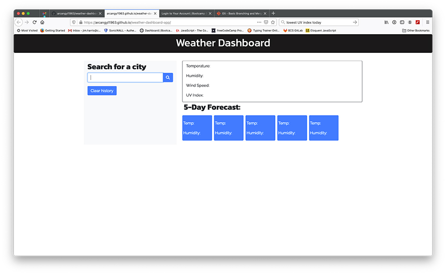
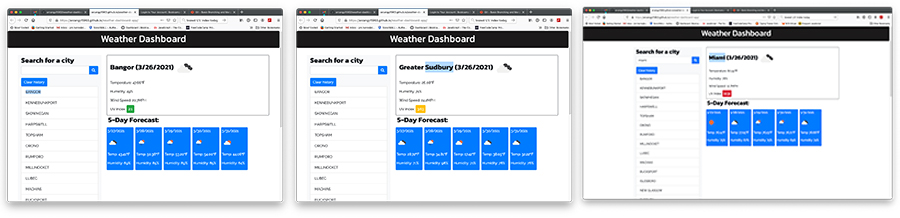

# Weather Dashboard App

## Description

The assignment was to build a weather dashboard app that displayed weather information for various cities. The app utilizes weather data retrieved from the OpenWeather API. The weather dashboard was to display weather information for the current date and 5-day weather forecast. The current day weather information includes information for temperature, humidity, wind speed, and a UV index. The UV index displays a color to indicate favorable weather conditions. A graphic icon representing the weather condition of the day is also displayed. The 5-day forecast section shows weather conditions expected for the following 5 days including temperature and humidity along with a graphic icon representing the expected conditions for that day.

There is a search field where the user can enter the desired city name for their search. Clicking the search button will initiate the retrieval of information to display in the GUI. All city name searches are stored in a list below a 'Clear History' button. Clicking the city name of a past search will redisplay the weather information for the date of that search. Clicking the 'Clear History' button will clear all saved search history information from storage.

## Installation

My files can be accessed in the repository [HERE](https://github.com/arcangyl1963/weather-dashboard-app)
The image below shows the repository where my project files are located:

The web application can be viewed [HERE](https://arcangyl1963.github.io/weather-dashboard-app/).

The images below show the various use stages of the Weather Dashboard Application: 

The first image shows the empty main app screen the user is presented with upon load.

The second image shows a city name entered into the text field for the city search function:

The third image shows the retrieved weather information for current day and 5-day forecast for the searched city.

The fourth image shows a second city search screen. Note that both searches are displayed in the Search History section.

The fifth image shows the color highlight when you hover over a city name in the Search History list. Clicking on the city name displays the weather information for the previous search date in the main section.

© 2021 arcangyl studios